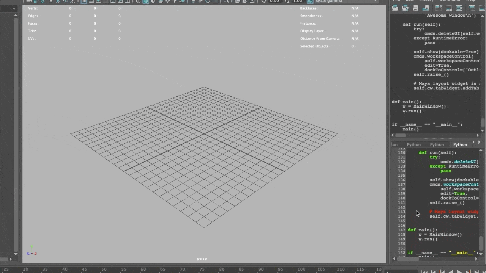
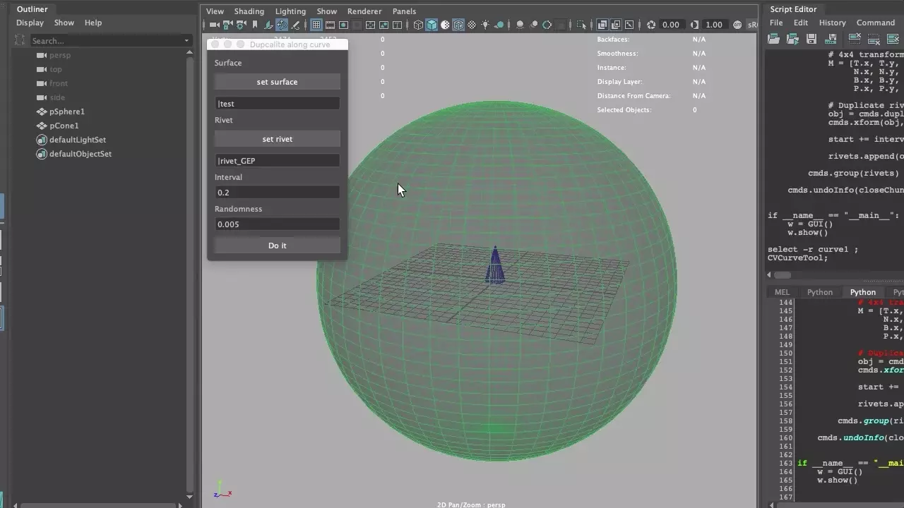
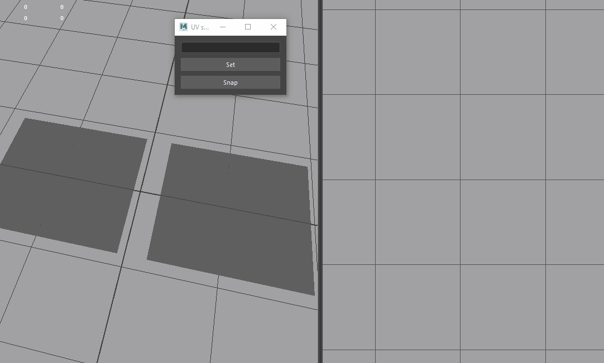

# miMayaScripts
maya scripts for my own

## [PySide sample window](./PySideWindow)

## [DuplicateObjAlongCurve](./duplicateObjAloneCurve.py)

## [FreezePntsAttr](./freezePntsAttr.py)

## [Rope](./rope.py)

## [SnapToClosestUVs](./snapToClosestUV.py)

## [SeparatePolygonByUVShells](./separatePolygonsByUVShell.py)

